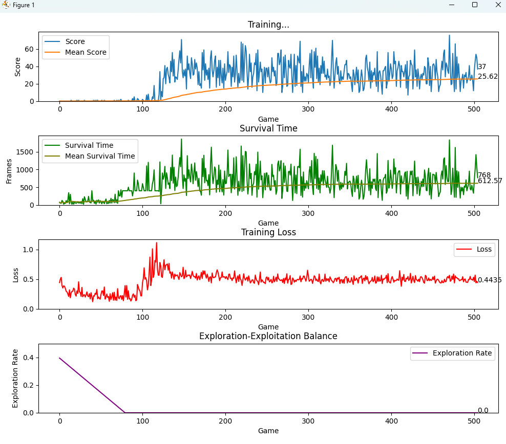

# Snake Game AI with Deep Q-Learning

A reinforcement learning project implementing an AI agent to play the classic Snake game using Deep Q-Learning. The agent progressively learns optimal strategies through trial and error, demonstrating how neural networks can be trained to master a simple but challenging game environment.

<div align="center">
  <table>
    <tr>
      <td></td>
      <td></td>
    </tr>
    <tr>
      <td colspan="2" align="center"></td>
    </tr>
  </table>
</div>

## Project Overview

This Snake Game AI was created as a final project for CS549: Machine Learning, taught by Professor Zhang at San Diego State University.

By implementing Deep Q-Learning, we've created an agent that learns to play Snake without any hardcoded rules, demonstrating the potential of reinforcement learning to solve sequential decision-making problems.

## Repository Branches

- **deep-learning**: Our baseline implementation with a basic DQN model and standard reward system
- **modified-deep-learning**: Enhanced version with improved reward mechanisms, flood fill pathing, and exploration strategies

## Features

- **Neural Network Agent**: A deep neural network that learns optimal gameplay strategies
- **Progressive Learning**: Agent improves play through experience (500+ training games)
- **Dynamic State Representation**: Efficient encoding of game state for the neural network
- **Visualized Training**: Real-time graphs showing score, survival time, and learning progress
- **Customizable Reward Systems**: Multiple reward mechanisms to guide agent behavior

## Technology Stack

### AI Implementation
- Written in Python using PyTorch
- Deep Q-Network (DQN) architecture
- Experience replay for stable learning
- Epsilon-greedy exploration strategy

### Game Environment
- Built with Pygame
- Custom reward system for reinforcement learning
- State representation optimized for neural networks

## Improvements in modified-deep-learning Branch

Our enhanced implementation includes several key improvements:

1. **Proximity-Based Rewards** (Added Change 1)
   - Rewards agent for moving closer to food
   - Penalizes moving away from food
   - Improves goal-directed behavior

2. **Wall and Self-Collision Avoidance** (Added Change 2)
   - Adds penalties for approaching walls
   - Penalizes proximity to snake's own body
   - Encourages safer navigation

3. **Time Efficiency Penalty** (Added Change 3)
   - Small penalty for each step taken
   - Promotes efficient pathfinding
   - Discourages aimless wandering

4. **Flood Fill Algorithm** (Added Change 4)
   - Calculates accessible space after potential moves
   - Prevents snake from trapping itself
   - Significantly reduces self-collisions for longer snakes

5. **Exploration Strategy Enhancements** (Added Change 5)
   - Increased early exploration rate
   - More gradual decay of random actions
   - Better balance between exploration and exploitation

## Results

Our experiments demonstrated significant improvements:

- **Baseline**: Average score: 25.62, Survival time: 612.57 frames
- **With Changes 1-3**: Average score: 28.6, Survival time: 602.88 frames
- **Final Version**: More sophisticated navigation with fewer self-trapping incidents

## How to Run

### Prerequisites
- Python 3.8 or higher
- PyTorch
- Pygame
- Matplotlib
- Numpy

### Setup
1. Clone the repository
   ```
   git clone https://github.com/yourusername/snake-game-ai.git
   cd snake-game-ai
   ```

2. Install dependencies
   ```
   pip install torch numpy pygame matplotlib
   ```

3. Train the model
   ```
   python train.py
   ```

4. Test the trained model
   ```
   python test.py
   ```

## Implementation Details

### Agent (agent.py)
- Implements the Q-learning algorithm
- Manages experience replay buffer
- Controls exploration vs. exploitation balance

### Game Environment (SnakeGame.py)
- Provides the interactive environment
- Calculates rewards based on agent actions
- Handles collision detection and game rules

### Neural Network (model.py)
- Defines the Q-function approximator
- Processes state information
- Predicts action values

### Training Loop (train.py)
- Orchestrates agent-environment interaction
- Records and visualizes performance metrics
- Saves the trained model

## About the Developers

This project was created by Jake De Los Reyes, Han Luu, Itzel Orozco, Matthew Smith, Jenny Tran, and Genesis Anne Villar as a collaborative effort for CS549 Machine Learning at San Diego State University.

## License

[MIT License](LICENSE)

## Acknowledgements

- Prof. Zhang for guidance throughout the CS549 course
- The PyTorch and reinforcement learning communities for documentation and examples
- Previous research on DQN applications in game environments

---

© 2025 Snake Game AI Team | [GitHub](https://github.com/msmith6127/SnakeGameAI)
